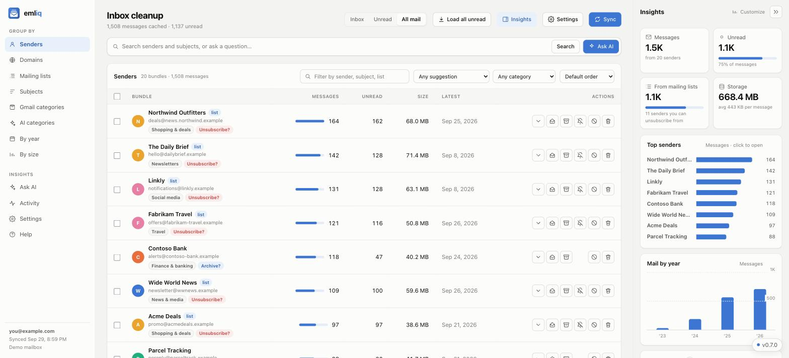
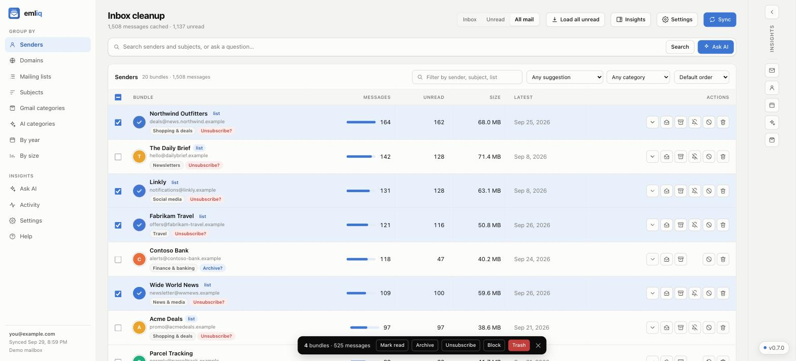
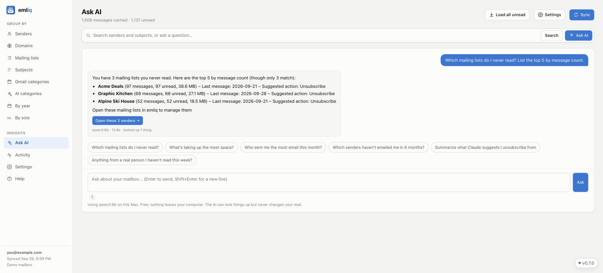
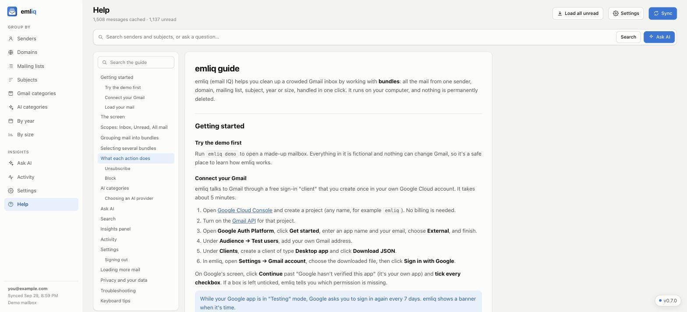

<p align="center">
  
</p>

<h1 align="center">emliq</h1>

<p align="center">
  <b>email IQ</b>: a free, private app that cleans up a messy Gmail inbox in bulk,<br>
  with optional AI that runs on your own computer.
</p>

<p align="center">A free app from <a href="https://appenablement.com"><b>App Enablement</b></a></p>

<p align="center">
  <a href="LICENSE"></a>
  <a href="https://github.com/yeshaib/emliq/actions/workflows/ci.yml"></a>
  
</p>



## Why emliq?

emliq (short for **email IQ**) started with an inbox holding more than 17,000 unread emails:
years of newsletters, store promotions, shipping notices and alerts, piled on top of the
messages that actually mattered.

Tools that fix this already exist, but they're paid subscriptions, and they work by
connecting your mailbox to a company's servers. emliq takes a different approach:

- **It runs on your computer.** Your mail is never sent to an emliq server; there isn't one.
- **It's free and open source** under the Apache 2.0 license.
- **It thinks in bundles, not messages.** It groups mail by sender, domain, mailing list,
  subject, category, year or size, so one click can archive, trash or unsubscribe from
  hundreds of messages at once.
- **AI is optional and can stay local.** A model running on your machine (via
  [Ollama](https://ollama.com)) can sort senders into categories, suggest what to keep,
  archive or unsubscribe from, and answer questions about your mailbox. You can use
  Anthropic's Claude instead if you prefer.

## What it does

- **Bundles:** see your mail grouped by sender, domain, mailing list, subject, Gmail
  category, AI category, year or size, with counts, unread counts and storage used.
- **Bulk actions:** mark read, archive, move to Trash, unsubscribe or block a bundle, or
  select many bundles and act on all of them together. Click a sender's circle to select,
  click more rows to add, Shift-click for a range.
- **Real unsubscribes:** uses the one-click unsubscribe standard (RFC 8058) when a sender
  supports it, otherwise sends the unsubscribe email for you, otherwise hands you their page.
- **Block:** creates a real Gmail filter, so future mail from that sender skips your inbox
  even when emliq isn't running.
- **AI categories:** each sender gets a category (Newsletters, Shopping & deals, Finance &
  banking, …) and a keep / archive / unsubscribe suggestion you can filter by.
- **Ask AI:** ask things like *"Which mailing lists do I never read?"* or *"What's taking up
  the most space?"*. Answers come with a button that opens the senders it found, ready to act on.
- **Search** across senders and subject lines.
- **Insights panel:** summary numbers and charts on the right; collapse it, or hide tiles you don't use.
- **Activity:** a log of everything emliq did, storage freed, and your inbox shrinking over time.
- **Built-in guide:** open **Help** in the app (or press **?**) for a searchable walkthrough of every feature.
- **Safe by design:** nothing is permanently deleted (Trash is recoverable for 30 days), and
  every action asks you first.

| Select and act in bulk | Ask about your mailbox |
|---|---|
|  |  |

| Built-in guide |
|---|
|  |

*Screenshots use emliq's built-in demo mailbox; every sender in them is made up.*

## Try it in 2 minutes (no Google account needed)

emliq needs Python 3.10 or newer. The easiest way to install it is with
[uv](https://docs.astral.sh/uv/), which takes care of Python for you.

**macOS / Linux** (Terminal):

```bash
curl -LsSf https://astral.sh/uv/install.sh | sh
uv tool install https://github.com/yeshaib/emliq/archive/refs/heads/main.zip
emliq demo
```

**Windows** (PowerShell):

```powershell
powershell -ExecutionPolicy ByPass -c "irm https://astral.sh/uv/install.ps1 | iex"
uv tool install https://github.com/yeshaib/emliq/archive/refs/heads/main.zip
emliq demo
```

(If `emliq` isn't found right after installing uv, open a new terminal window.)

`emliq demo` opens a made-up mailbox in your browser so you can click around. Nothing in it
is real, and anything that would change Gmail is turned off. To use your own Gmail, set it
up once as described below, then run `emliq serve`.

To update later: `uv tool install --reinstall https://github.com/yeshaib/emliq/archive/refs/heads/main.zip`.
To remove: `uv tool uninstall emliq`.

## Connect your Gmail

Google only lets apps read and organize Gmail with your permission, through a sign-in
"client" that you create for free in your own Google Cloud account. It takes about 5 minutes
and you only do it once. Because the client belongs to you, no third party ever gets access
to your mail.

1. Open [Google Cloud Console](https://console.cloud.google.com/projectcreate) and create a
   project (any name, e.g. `emliq`). No billing is needed.
2. Turn on the **Gmail API**: [open it here](https://console.cloud.google.com/apis/library/gmail.googleapis.com),
   make sure your project is selected, click **Enable**.
3. Set up the consent screen: go to **Google Auth Platform → Branding**, click
   **Get started**, enter an app name (`emliq`) and your email, choose **External**, and finish.
4. Under **Google Auth Platform → Audience → Test users**, click **Add users** and add your
   own Gmail address.
5. Under **Google Auth Platform → Clients**, click **Create client**, choose
   **Desktop app**, and click **Download JSON** on the confirmation dialog.
6. Run `emliq serve`, open **Settings**, choose the downloaded file under **Gmail account**,
   then click **Sign in with Google**. On Google's screen, click **Continue** past the
   "Google hasn't verified this app" notice (it's your own app) and **tick every checkbox**.

Then click **Load all unread** to fetch your unread mail, and start cleaning. For a full
walkthrough of every feature, open **Help** in the app (or press **?**), or read the
[guide](emliq/GUIDE.md) here on GitHub.

> **Good to know:** while your Google app is in "Testing" mode, Google asks you to sign in
> again every 7 days. That's a Google rule for unverified apps; emliq shows a banner when
> it's time.

## AI (optional)

Pick a provider in **Settings → AI provider**.

**Local model with Ollama (free, fully private).** Install [Ollama](https://ollama.com),
then in emliq's Settings click **Download** next to a recommended model:

| Model | Download | Notes |
|---|---|---|
| `qwen3:14b` | 9.3 GB | Most accurate; runs well on Macs with 24 GB of memory or more |
| `qwen3:8b` | 5.2 GB | About twice as fast, slightly less accurate; fine with 16 GB |

Categorizing ~2,000 senders takes roughly 30 minutes on an Apple Silicon Mac; questions take
10–20 seconds. You can stop categorizing at any time and resume later.

**Claude (Anthropic API).** Faster and more accurate. Paste an
[API key](https://console.anthropic.com/settings/keys) into Settings (it's tested, then stored
only on your computer). Categorizing ~2,000 senders costs about $2–5 once; each Ask AI
question costs a few cents. emliq shows the estimate and asks before anything runs.

**What the AI sees:** sender names and addresses, message counts, whether a sender is a
mailing list, and a few recent subject lines. Never the body of an email. With Ollama none of
it leaves your computer; with Claude it's sent to Anthropic.

## How it works and your privacy

- emliq downloads **message headers only**: sender, subject, date, Gmail labels, size and the
  unsubscribe header. It asks Gmail for `format=metadata` with a field mask, so Gmail never
  sends message bodies, previews or attachments, and emliq refuses to store content even if it
  arrived ([`emliq/sync.py`](emliq/sync.py)). The test suite checks this on every change.
  Note that Gmail has no permission that allows archiving and trashing without also *allowing*
  content access, so this guarantee comes from emliq's open-source code, which you can review.
- Everything lives in one folder on your computer: `~/.emliq` on macOS/Linux,
  `C:\Users\<you>\.emliq` on Windows. It holds your Google client file, your sign-in token and
  the database.
- The web interface runs at `http://localhost:8787` and only accepts connections from your
  own computer.
- Gmail permissions requested: *read, compose, send and organize* (to read headers, archive,
  trash and send unsubscribe emails) and *manage basic mail settings* (to create Block
  filters). emliq can't permanently delete mail.
- **Update check:** once a day emliq asks GitHub for its latest public release so it can show
  "Update available". Nothing about you or your mail is sent, and emliq never updates itself.
  Turn it off in **Settings → Updates**.
- **Sign out** in Settings removes emliq's access at Google and can delete the local data.
  You can also revoke access any time at [myaccount.google.com/permissions](https://myaccount.google.com/permissions).

## Command line

| Command | What it does |
|---|---|
| `emliq serve` | Start the app and open it in your browser (`--port`, `--no-browser`) |
| `emliq demo` | Start a made-up demo mailbox (`--reset` for fresh data) |
| `emliq sync` | Fetch new mail changes (`--query "is:unread"`, `--full`, `--max N`) |
| `emliq login` | Sign in from the terminal instead of the app |
| `emliq bundles` | Print the biggest bundles (`--view list`, `--scope all`) |

## Run with Docker

```bash
git clone https://github.com/yeshaib/emliq.git && cd emliq
docker compose up -d --build        # then open http://localhost:8787
```

Data is stored in `~/.emliq` on the host (set `EMLIQ_DATA` to use another folder). For AI, the
container talks to Ollama on your host automatically, and passes through `ANTHROPIC_API_KEY`
from your shell or a `.env` file. Ports are only published on `127.0.0.1`. emliq has no
password of its own, so don't expose it to the internet; use an SSH tunnel or a private
network such as Tailscale to reach it from elsewhere.

## FAQ

**Is this safe to run on my real inbox?**
Every action asks first, trashed mail stays recoverable for 30 days, and emliq can't
permanently delete anything. Try the demo first if you want to get a feel for it.

**Why do I have to create my own Google Cloud project?**
Apps that read Gmail must be registered with Google. A shared, verified emliq app would
require Google's paid yearly security audit and would put one party in the middle of
everyone's mail. Your own client keeps access between you and Google.

**Does it work with Outlook, Yahoo or iCloud?**
Not yet; emliq currently supports Gmail only. Contributions are welcome.

**Can I use it on Windows?**
Yes. The instructions above work in PowerShell, and the test suite runs on Windows, macOS
and Linux for every change.

## Development

```bash
git clone https://github.com/yeshaib/emliq.git && cd emliq
uv venv && uv pip install -e .
.venv/bin/emliq demo                 # Windows: .venv\Scripts\emliq demo
python tests/run_tests.py            # end-to-end tests with a fake Gmail, Claude and Ollama
```

The code is small and dependency-light: a Flask server (`emliq/web.py`), a single-page UI
(`emliq/static/index.html`), SQLite, and the Gmail API. See [CONTRIBUTING.md](CONTRIBUTING.md),
[SECURITY.md](SECURITY.md) and the [changelog](emliq/CHANGELOG.md).

| File | Purpose |
|---|---|
| `emliq/sync.py` | Gmail header sync (full, incremental, search-based), rate limiting |
| `emliq/bundles.py` | Grouping and dashboard queries |
| `emliq/actions.py` | Archive, trash, mark read, unsubscribe, block |
| `emliq/ai.py`, `emliq/ollama.py` | Sender categorizing with Claude or Ollama |
| `emliq/ask.py` | Ask AI: read-only lookup tools and the model loop |
| `emliq/analytics.py` | Activity log and mailbox snapshots |
| `emliq/demo.py` | The made-up demo mailbox |

## License

emliq is a free app from [App Enablement](https://appenablement.com), open source under the
[Apache License 2.0](LICENSE). You may use, modify and
share it, including commercially, under the license's terms; see [NOTICE](NOTICE).

emliq is an independent project and is not affiliated with Google, Anthropic, Ollama or any
email provider. Gmail is a trademark of Google LLC.
